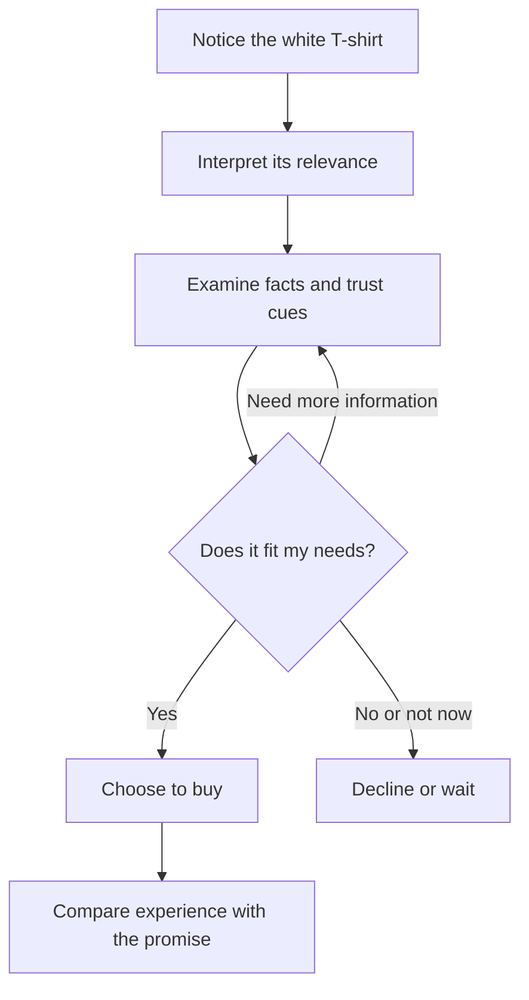

# Chapter 1: Persuasion and Human Decision-Making

[Back to the guide](README.md) | [Next: Brand Archetypes](02-archetypes.md)

## What Persuasion Does

Persuasion is communication intended to influence how someone understands a situation or chooses to act. It can shape **attention** (what you notice), **interpretation** (what it means), **trust** (what you believe), and **action** (what you decide to do).

Imagine a page selling a plain white T-shirt. A photograph attracts attention, a headline suggests an occasion, measurements help you judge the fit, and a clear purchase button offers a next step. Each choice participates in persuasion. None guarantees a sale.

## Persuasion, Manipulation, and Coercion

Ethical persuasion gives people relevant reasons while preserving informed choice. Manipulation undermines that choice through deception, concealed information, or pressure that exploits vulnerabilities. Coercion uses force or threats to compel a decision. The boundaries deserve attention: something can be persuasive and manipulative at the same time.

| Approach | Imaginary T-shirt example | What happens to choice? |
| --- | --- | --- |
| Ethical persuasion | Show the actual fit and explain the return terms. | The buyer can evaluate the offer and decline. |
| Manipulation | Display a countdown that resets every time the page opens. | False urgency distorts the decision. |
| Coercion | Threaten a penalty unless someone buys the shirt. | A threat replaces a freely considered choice. |

Being emotional is not automatically manipulative. A joyful photograph can honestly communicate an intended mood. The problem starts when the presentation conceals facts or makes belonging depend on a purchase.

## Cialdini's Principles of Influence

Robert Cialdini's framework includes seven principles; earlier versions listed six, before unity was added. These describe possible influences, not buttons that control everyone. The definitions below follow his organization's [overview of the principles](https://www.influenceatwork.com/7-principles-of-persuasion/); the applications are hypothetical.

| Principle | Mechanism | Ethical use | Misuse risk |
| --- | --- | --- | --- |
| Reciprocity | A benefit invites reciprocation. | Offer useful care advice freely. | Turn a gift into an obligation. |
| Commitment and consistency | People value alignment with prior choices. | Support a freely chosen wardrobe goal. | Trap buyers through escalating commitments. |
| Social proof | Others' behavior provides a cue. | Show genuine customer feedback. | Invent reviews. |
| Authority | Relevant expertise lends credibility. | Identify a qualified fabric assessor. | Fake credentials. |
| Liking | Affinity can increase receptiveness. | Communicate warmly and honestly. | Pretend personal friendship. |
| Scarcity | Limited availability can increase appeal. | Report actual remaining stock. | Invent shortages. |
| Unity | Shared identity creates a sense of “us.” | Recognize a real community. | Exclude people who decline. |

Liking concerns affinity with someone; unity concerns feeling part of the same group. Neither proves that the shirt suits your needs. Likewise, popularity and expertise are cues to examine, not substitutes for evidence.

## Two More Useful Lenses

### Framing: What Makes This Choice Meaningful?

Framing is the way information is presented. Tversky and Kahneman's research showed that different descriptions of a decision can change preferences even when the underlying outcomes are equivalent. See their paper, [The Framing of Decisions and the Psychology of Choice](https://doi.org/10.1126/Science.7455683).

For our imaginary shirt, “a starting point for your next outfit” emphasizes creative possibility; “one less wardrobe decision” emphasizes simplicity. This is an application of the framing idea, not a tested claim that either headline sells more. The shirt stays the same. Honest framing keeps important facts visible even when the emphasis changes.

### Rhetorical Appeals: Credibility, Reasons, and Emotion

Aristotle distinguishes persuasion through the speaker's character, the audience's emotions, and the argument itself in [Rhetoric, Book I, Part 2](https://classics.mit.edu/Aristotle/rhetoric.1.i.html). These are commonly called **ethos**, **pathos**, and **logos**.

For a hypothetical product page, admitting what a fit photo cannot show helps establish credibility. A measurement chart supplies reasons for choosing a size. A relaxed weekend scene evokes emotion. Ask whether those three parts support each other: a comforting image cannot establish an unsupported claim about fabric quality.

## A Simple Decision Journey

This is a teaching model, not a prediction of every shopper's behavior. A useful design supports the information-seeking and declining paths too.

## Questions to Ask Before Trying to Persuade

- What response would actually benefit this audience?
- Which claims can I support, and what information is missing?
- Can someone decline without shame, confusion, or a hidden penalty?
- Am I using real evidence or merely the appearance of evidence?
- Would the message still feel fair if I explained how it works?

## Explore Further

**External research suggestions:** Search for “Cialdini unity principle,” “Tversky Kahneman framing 1981,” and “Aristotle rhetoric ethos pathos logos.” Prefer the original authors, university libraries, and primary texts. Compare a claim with its evidence and note the setting before applying it to shopping.

## What You Should Remember

Persuasion shapes attention, meaning, trust, and action. Use influence principles to help people evaluate a real choice. A successful ethical presentation can also help someone decide that the shirt is not for them.
