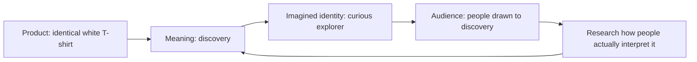

# Chapter 2: Brand Archetypes and Meaning

[Previous: Persuasion](01-persuasion.md) | [Back to the guide](README.md) | [Next: Design Language](03-design-language.md)

## A Product Can Carry a Story

A white T-shirt covers your body. Its presentation might also suggest freedom, belonging, creativity, or confidence. A **brand archetype** is a recurring narrative pattern used to organize that meaning across words, images, and experiences.

The practical question is: **What does the audience get to feel, imagine, or become by choosing this brand?** An Explorer story invites discovery; a Caregiver story emphasizes care. Neither changes the shirt's stitching.

This chapter uses a familiar twelve-archetype branding vocabulary. Carol S. Pearson describes how her model developed and how its labels change across applications, including branding, in [The 12-Archetype System](https://carolspearson.com/about/the-pearson-12-archetype-system-human-development-and-evolution). Here, the labels are creative planning tools, not personality diagnoses or proof of universal customer behavior.

## A Useful Set of Archetypes

The last column contains invented directions for the same plain shirt, not claims about existing brands.

| Archetype | Meaning to explore | Possible T-shirt presentation |
| --- | --- | --- |
| Explorer | Freedom and discovery | A starting point for an unfamiliar route. |
| Sage | Understanding | Clear facts and a thoughtful fit guide. |
| Creator | Originality | A blank foundation for personal styling. |
| Ruler | Order and command | A deliberate, composed wardrobe. |
| Caregiver | Care and support | A considerate everyday routine. |
| Rebel / Outlaw | Independence from conventions | A refusal to wear someone else's slogan. |
| Hero | Courage and effort | Getting dressed for a personal challenge. |
| Everyperson | Belonging | Everyday scenes with varied wearers. |
| Innocent | Simplicity and optimism | An uncomplicated beginning to the day. |
| Jester | Play | A joke about taking a plain shirt seriously. |
| Lover | Connection and appreciation | Attention to styling and personal expression. |
| Magician | Transformation and possibility | One shirt imagined in different outfits. |

These are possible interpretations rather than a lookup table for human motivation. A Hero concept does not establish athletic performance, and a Caregiver concept does not establish safe or fair manufacturing. Evidence must carry those claims.

## Three Shirts That Are Really One Shirt

Assume the physical shirt, price, and terms are identical. The following headlines and stories are original classroom examples.

### Explorer: “Take the Unfamiliar Turn”

Show someone wearing the shirt while exploring an unfamiliar neighborhood. Pair the photograph with an open layout and a short invitation to notice something new. The audience is a curious person planning an ordinary day out. The meaning offered is independence, not a promise of adventure equipment.

### Creator: “The Outfit Starts With You”

Show the same shirt beside sketches and several styling ideas. Use expressive headings with readable product details. The audience enjoys assembling an individual look. The meaning offered is authorship. Keep the actual shirt white and unprinted; the artwork belongs to the presentation.

### Everyperson: “A Place in Your Everyday”

Show the same shirt in familiar settings: a study break, a kitchen table, a walk with friends. Use direct copy and approachable photography. The audience wants something that fits ordinary routines. The meaning offered is belonging, without suggesting that buying a shirt is a requirement for friendship.

The arrows show a proposed story. Audience research checks whether people recognize, welcome, or reject it.

## Archetypes Are Not Destiny

A person can want adventure on Saturday and predictability on Monday. A brand can combine tendencies too: Explorer may guide the overall story while Sage guides clear, useful information.

Cultural context matters. A landscape presented as freedom to one audience may suggest isolation to another. Words such as “rebel” can evoke playfulness, political struggle, or danger. Investigate those interpretations instead of assigning an identity based on someone's age, nationality, or appearance.

Choose a leading theme for coherence, then test specific choices. Avoid treating a framework as a scientific classification of everyone who might buy the product. If the story clashes with the audience's experience, revise the story.

## Questions to Ask When Choosing an Archetype

- Which meaning fits both the product and the audience's situation?
- What would this story sound and look like in a concrete example?
- Which product facts support the promise, and which remain unknown?
- Could the imagery stereotype or exclude someone?
- Where would a second archetype help, and where would it confuse the message?
- What feedback would make me change this interpretation?

## What You Should Remember

Archetypes help coordinate a recognizable brand story. They offer hypotheses about meaning, not fixed identities. The same shirt can invite discovery, creativity, or belonging, but its factual claims still need evidence.
