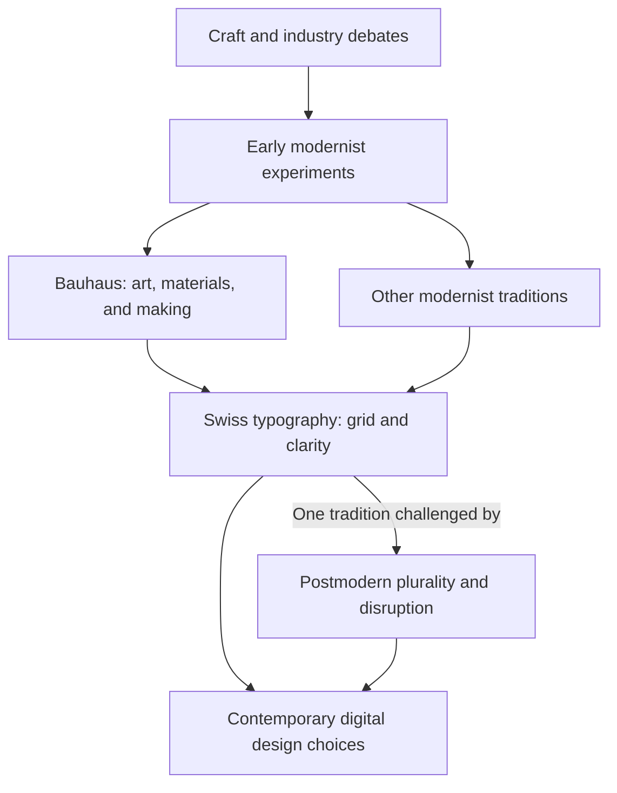

# Chapter 3: Modernism, Postmodernism, and Visual Language

[Previous: Brand Archetypes](02-archetypes.md) | [Back to the guide](README.md) | [Next: The T-Shirt Case Study](04-white-tshirt-case-study.md)

## Design Makes an Argument Before You Read

A page with aligned columns and measured spacing might suggest precision. A page with overlapping lettering and clashing patterns might suggest experimentation. Those are possible readings, not meanings guaranteed by a font or color.

**Visual language** is the combined effect of layout, typography, color, imagery, and spacing. Understanding its history gives you more deliberate choices than simply asking for something that looks “modern.”

## A Short Path into Modernism

### Before the Bauhaus: Craft, Industry, and Change

In the late nineteenth century, Arts and Crafts designers questioned industrial production and the status of everyday objects. Their interest in materials and useful making helped prepare some paths toward modernism. See the V&A's [introduction to Arts and Crafts](https://www.vam.ac.uk/articles/arts-and-crafts-an-introduction).

Early twentieth-century modernists sought forms suited to new ways of living. Many treated design as a means of social change, using industrial production, simplified forms, and reduced ornament. Modernism contained several approaches rather than one fixed style. The V&A explains these ambitions in [What was Modernism?](https://www.vam.ac.uk/articles/what-was-modernism).

### Bauhaus: Learn by Making

Walter Gropius founded the Bauhaus in Weimar in 1919; the school operated until 1933. It brought art and design education together through studies of materials, color, form, and workshop practice. Its early emphasis on craft increasingly engaged with industrial production. Typography and photography became important tools of communication. See The Met's [The Bauhaus, 1919–1933](https://www.metmuseum.org/essays/the-bauhaus-1919-1933).

The useful lesson is to connect appearance with materials, production, and use. Calling every geometric poster “Bauhaus” erases the school's variety and changing priorities.

### Swiss / International Typographic Style: Organize the Message

After the Second World War, Swiss graphic design developed an influential approach also called the International Typographic Style. Its vocabulary included typographic grids, sans serif type, precise composition, restrained color, and photography. The [Swiss National Library's account](https://www.nb.admin.ch/en/the-international-style-1950-1970) describes this emphasis on structure and readability.

In practical terms, a **grid** aligns related elements; **hierarchy** indicates reading order; **clarity** makes information understandable; **reduction** removes distractions; and **function** connects the design to a task. A grid can support an energetic, asymmetric composition. It does not require every element to be centered or identical.

## The Postmodern Reaction

Postmodern design, especially associated with the 1970s and 1980s, challenged modernist certainty about progress, order, and a universal visual language. It made space for contradiction, historical references, theatricality, and competing styles. The V&A describes this shift in [What is Postmodernism?](https://www.vam.ac.uk/articles/what-is-postmodernism).

**Plurality** allows several voices. **Quotation** borrows recognizable visual conventions. **Irony** creates a gap between an apparent message and its intended meaning. **Disruption** breaks expectations, while **expressive typography** makes letters participate in the image. These techniques can invite interpretation, but surprise alone does not make a design useful.

## Compare the Tensions

These are teaching contrasts, not rules that every historical designer followed.

| Tension | Modernist emphasis | Postmodern possibility | Question for a designer |
| --- | --- | --- | --- |
| Order / disruption | Predictable organization | Deliberately interrupted patterns | Which information needs immediate recognition? |
| Universality / identity | A shared, consistent visual system | Particular cultural voices | Whose assumptions shape the design? |
| Clarity / expression | Direct communication | Ambiguity and personality | Where is interpretation welcome? |
| Grid / anti-grid | Visible alignment and rhythm | Overlap, collision, or broken alignment | Does the reading order still work? |
| Restraint / abundance | Fewer competing elements | Layered references and decoration | What deserves the most attention? |
| Function / irony | Form makes the task understandable | Form comments on the task or product | Will the audience understand the joke? |

The diagram simplifies overlapping influences. Postmodernism did not erase modernism, and neither label explains all design traditions.

## The Tensions Still Work on Screens

Consider these hypothetical digital designs rather than claims about particular current websites:

- A course registration page uses a grid, stable labels, and a clear hierarchy so students can compare sections.
- A music-event page uses layered lettering and playful references to express a scene's identity.
- The event's booking form returns to predictable controls and readable information so the expressive opening does not obstruct a purchase.

One product can use both traditions. Minimalism can hide information, and abundance can communicate clearly when carefully organized. Check reading order, contrast, keyboard access, and narrow-screen behavior in an actual implementation; historical style labels do not establish accessibility.

## How to Read a Design

1. Describe what you can see: alignment, size, spacing, colors, images, and lettering.
2. Trace what attracts your attention first, second, and third.
3. Separate observation from interpretation: “three aligned columns” is visible; “trustworthy” is your reading.
4. Ask who the intended audience might be and which cultural knowledge the design assumes.
5. Identify the task, then try it. Can you find the information needed to act?
6. Support a historical label with context and evidence, not visual resemblance alone.

## Museum Research

**External research suggestions:** Use the institutions' own collection searches. The terms below are starting points, not claims that a particular object will appear.

| Institution | Search terms to try | What to inspect |
| --- | --- | --- |
| The Metropolitan Museum of Art | Bauhaus typography; Herbert Bayer | Relationships between lettering and composition |
| MoMA | Bauhaus graphic design; modernist poster | How the catalog describes purpose and context |
| Cooper Hewitt | Swiss poster; typographic grid | Alignment, hierarchy, and image placement |
| V&A | postmodernism; Memphis design | Color, historical references, and irony |
| Bauhaus-Archiv | workshops; typography | Materials, teaching, and changes over time |

Choose two actual records. Record each object's title, maker, date or date range, medium, institution, accession number if supplied, and the exact record URL. Preserve uncertainties such as “attributed to” or approximate dates. Distinguish the museum's description from your interpretation, and check image reuse terms before copying an image. If a record is incomplete, say so rather than filling the gaps.

## The Same White T-Shirt, Two Presentations

A Swiss-influenced page could pair one shirt photograph with aligned measurements and the headline “A Clear Starting Point.” A postmodern page could surround that identical photograph with oversized punctuation, collage, and “Nothing to See Here. Everything to Style.” These are original concept headlines.

The first invites a reading of order; the second invites playful interpretation. Keep the shirt white and unprinted, and keep the factual product details equally available in both.

## What You Should Remember

Visual language carries assumptions about order, identity, and expression. History offers overlapping approaches you can combine deliberately. Judge the result by its meaning, context, and usefulness, then verify historical examples through actual collection records.
