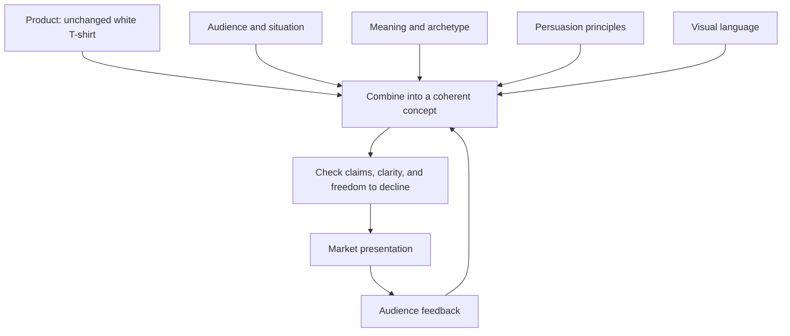

# Chapter 4: One White T-Shirt, Four Different Invitations

[Previous: Design Language](03-design-language.md) | [Back to the guide](README.md) | [Next: Synthesis](05-synthesis.md)

## The Product Is Fixed

Imagine one ordinary, high-quality plain white T-shirt. That quality is an assumption of the exercise, not a tested claim about a real garment. Keep its fabric, construction, cut, color, available sizes, price, and sales terms identical across all four concepts. No added logos, dyes, prints, or performance features.

We will change the audience emphasis, story, imagery, and presentation. All concept names, headlines, and product stories below are original fictional examples. None uses real sales data, endorsements, or customer testimonials.

## Concept 1: The Open Route

- **Target audience:** Curious students who enjoy exploring unfamiliar places during ordinary free time.
- **Brand archetype:** Explorer.
- **Persuasive principles:** Framing presents the shirt as part of discovery. Commitment and consistency connect the message to a freely chosen interest in exploring, without creating a new obligation.
- **Visual language:** An airy editorial layout, generous margins, a clear sans serif heading, and a muted map-like accent around the photography.
- **Headline:** “Start With a Blank. See Where You Go.”
- **Short product story:** “No destination printed across your chest. Wear the white tee you already understand, step outside, and let the afternoon supply the story. An unfamiliar corner is enough of a beginning.”
- **Likely imagery:** A wearer studying a street map or taking a new neighborhood route. Show the actual shirt's appearance rather than adding imaginary technical details.
- **Meaning offered:** Independence and curiosity. The customer is invited to imagine being someone who notices possibilities.
- **Ethical risk or limitation:** Outdoor imagery can imply weather resistance or special durability. Keep the scene ordinary and make no performance or environmental claims without evidence. Curiosity does not require a purchase.

## Concept 2: The Considered Basic

- **Target audience:** People who want to compare wardrobe options carefully and reduce unnecessary decisions.
- **Brand archetype:** Sage, with an emphasis on understanding.
- **Persuasive principles:** Logos supports evaluation through clearly presented product facts. Framing makes the shirt a straightforward wardrobe choice. No expert endorsement is implied.
- **Visual language:** Restrained modernist / Swiss-influenced design: a consistent grid, left-aligned sans serif type, strong hierarchy, ample space, and one precise product photograph.
- **Headline:** “One Shirt. A Clear Choice.”
- **Short product story:** “Here is the shirt from the front, back, and side. Look closely, compare it with what you wear, and decide whether it has a place in your week. A simple presentation leaves room for your judgment.”
- **Likely imagery:** Evenly lit front and back views, a seam detail, and a size-chart area. A real page would require measured values before filling that chart.
- **Meaning offered:** Deliberateness and confidence in one's own judgment.
- **Ethical risk or limitation:** A tidy layout can make weak evidence look authoritative. It does not prove sustainability, fair labor, or superior quality. Identify missing facts instead of inventing specifications.

## Concept 3: The Unscripted Uniform

- **Target audience:** People interested in experimental styling and skeptical of slogans that tell them who to be.
- **Brand archetype:** Rebel, with a playful Creator tendency.
- **Persuasive principles:** Framing turns plainness into room for self-expression. Pathos uses humor and the pleasure of defying expectations; it does not establish product quality.
- **Visual language:** Disruptive postmodern collage, contrasting display type, deliberate overlaps, bright accents, and an ironic advertising voice. Keep the product information in a readable area.
- **Headline:** “This Shirt Has Nothing to Say. Your Move.”
- **Short product story:** “No borrowed catchphrase. No prewritten personality. Just the same white tee, ready to join an outfit that makes sense to you. The loud part is entirely optional.”
- **Likely imagery:** The unchanged white shirt against cut-paper shapes and original doodles. Place the graphics around the garment, never on it.
- **Meaning offered:** Permission to express individuality and question fashion conventions.
- **Ethical risk or limitation:** Selling rebellion can become another demand to conform. Avoid mocking people who prefer ordinary clothing or implying that purchasing the shirt makes someone independent. Keep the visual disruption from obscuring essential details.

## Concept 4: The Everyday Circle

- **Target audience:** Students who prefer familiar routines and an approachable style over an exclusive image.
- **Brand archetype:** Everyperson.
- **Persuasive principles:** Liking works through a friendly, recognizable tone. Unity invites a sense of shared everyday experience. Genuine social proof could be added later, but this fictional concept contains no reviews or popularity claims.
- **Visual language:** A simple photo grid, warm surrounding colors, readable type, and conversational captions. Retain the shirt's white color in every image.
- **Headline:** “For the Days We Share.”
- **Short product story:** “A study session runs long. Someone puts the kettle on. You talk, laugh, and get back to work. This white tee fits into the picture without needing to become its main event.”
- **Likely imagery:** Consenting models in everyday group settings, showing varied ways of wearing the same garment. Label staged images appropriately rather than presenting models as actual customers.
- **Meaning offered:** Familiarity and belonging without a status performance.
- **Ethical risk or limitation:** Friendship must not become a reward supposedly unlocked by buying. Representation also cannot substitute for an actual range of sizes or accessible service; describe those only when verified.

## Synthesis Table

| Concept | Audience emphasis | Archetype | Persuasion | Visual language | Meaning offered |
| --- | --- | --- | --- | --- | --- |
| The Open Route | Everyday discovery | Explorer | Framing; consistency | Airy editorial layout | Independence |
| The Considered Basic | Careful comparison | Sage | Logos; framing | Restrained Swiss grid | Informed confidence |
| The Unscripted Uniform | Experimental styling | Rebel / Creator | Framing; pathos | Postmodern collage | Self-expression |
| The Everyday Circle | Familiar routines | Everyperson | Liking; unity | Warm, readable photo grid | Belonging |

## Try a Fair Comparison

Show two presentations with the same product facts, price, and terms. Ask classmates what each seems to promise, what they would need to know, and whether anything feels misleading. A few classmates' reactions can reveal questions; they cannot establish what all customers will do.

Then swap one element, such as moving the Explorer headline into the Swiss layout. Does the story still feel coherent? Archetypes do not belong permanently to particular visual styles. Explain the resulting interpretation before assuming that a familiar pairing is best.

## What You Should Remember

The garment stays fixed while its presentation offers different meanings. A coherent concept connects audience, archetype, persuasion, and visual language. Its promises must remain proportionate to what the unchanged product can actually provide.
