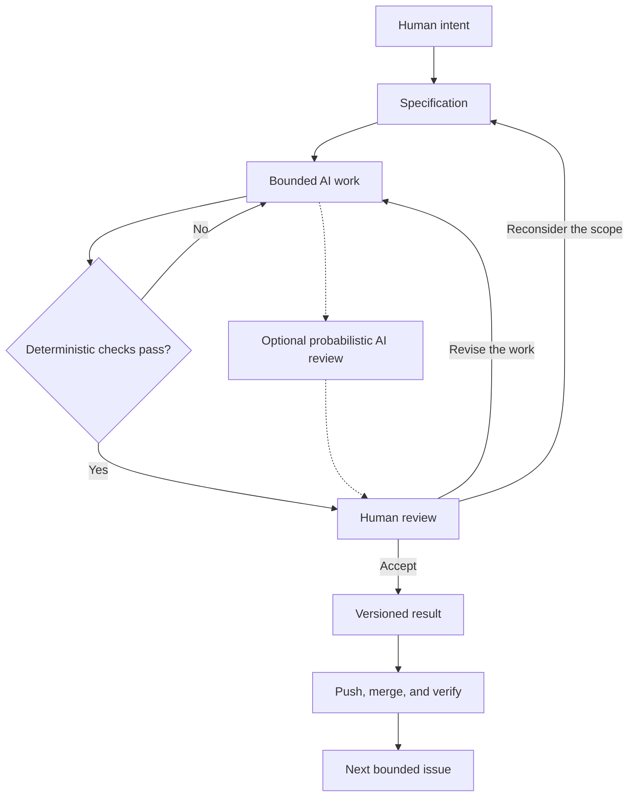

# Chapter 5: From Human Intent to a Versioned Result

[Previous: The T-Shirt Case Study](04-white-tshirt-case-study.md) | [Back to the guide](README.md)

## Three Lenses, One Direction

The same white T-shirt has carried four different stories. Persuasion helped define a possible response, archetypes organized meaning, and visual language made the meaning visible. Together, these lenses give you a practical way to direct creative work, including work assisted by AI.

| Lens | Guiding question | Explorer T-shirt example | Concrete instruction for AI |
| --- | --- | --- | --- |
| Persuasion | What response are we trying to enable? | Help a curious reader evaluate the shirt. | Invite comparison without invented urgency. |
| Archetype | What meaning or identity are we expressing? | Everyday discovery and independence. | Use an Explorer story without promising transformation. |
| Design language | How should that meaning look and feel? | Open space, legible type, and a clear route through the facts. | Describe a restrained layout with one focal photograph. |

These choices need to agree. An invitation to freedom loses credibility if the page pressures people with a fake deadline. A story about informed choice needs understandable information, not just a serious-looking font.

## Make the Request a Specification

A **specification** states what to produce, what constraints apply, and how you will judge completion. “Make it good” leaves too many decisions unstated. A bounded task gives AI enough direction to help and gives a reviewer a manageable result to inspect.

For example, this is a hypothetical prompt for a later exercise, not an extra file required by this practical:

```text
Produce a Markdown draft of an Explorer presentation for the same
plain white T-shirt described in Chapter 4.

Audience: students interested in everyday discovery.
Response: help readers decide whether the shirt fits their needs.
Meaning: curiosity and independence.
Visual direction: open layout, readable type, one focal photograph.

Include one headline of at most 10 words, a 60–90-word product story,
an imagery direction, and one ethical limitation.
Keep the product, price, and terms unchanged. Do not invent material
specifications, customer reviews, scarcity, or performance claims.
Mark any missing factual information explicitly.
Return only the requested draft; do not modify other project files.
```

This combines a creative direction with boundaries that can be reviewed. The same approach works for a technical task: define a user need, specify a bounded change, and describe the observable behavior that would count as success.

## Use Different Checks for Different Questions

| Check | What it can establish | What it cannot establish |
| --- | --- | --- |
| Specification review | The task has a clear output and constraints. | That the proposed direction is appropriate. |
| Deterministic check | With the same input and environment, a rule consistently passes or fails. | That the content is truthful or meaningful. |
| Probabilistic AI review | An AI reviewer may notice omissions, contradictions, or unclear explanations. | A guarantee of completeness, truth, or consistent judgment. |
| Human judgment | A responsible person can evaluate evidence, purpose, context, and consequences. | Infallibility; people still need evidence and feedback. |

**Deterministic** checks are useful because they are cheap and repeatable. Examples include checking that a file exists, counting words, resolving a relative link, or parsing a Mermaid diagram. A valid diagram might still express a misleading relationship.

In this repository, [the provided GitHub Action](../.github/workflows/grade.yml) requires six nonempty textbook files. It also reports issue references and Mermaid usage. It does not judge chapter accuracy or render diagrams, and those reporting steps do not enforce every assignment criterion. Read a passing result as evidence about those specific checks.

**Probabilistic** review can broaden the inspection. Ask an AI reviewer to compare a draft against each requirement, identify unsupported claims, and explain its uncertainty. It may miss mistakes or confidently suggest a bad correction. A second AI answer is still something to evaluate, not independent proof that the first answer was correct.

## Why Git Matters When AI Generates Work

Git records committed versions so you can see what changed and recover earlier work. A branch separates one issue's work; a diff shows the changes; a commit records a checkpoint. An issue reference links that checkpoint to its purpose.

If AI replaces a careful explanation with a confident error, a focused diff makes the change easier to find. An earlier commit gives you a recovery point. Saving a file alone does not create a Git checkpoint, and pushing publishes commits rather than unsaved or uncommitted edits.

For this practical, use one issue and branch per stage, review the relevant files, commit with the actual issue number, push, merge, and check the result. The stage number and GitHub issue number may differ. Chapter 5's stage includes both this file and the book's table of contents.

## Human Review Is the Pit Stop

Think of the workflow as a race car with planned pit stops. Automation handles repeatable checks, but the team deliberately pauses to inspect conditions and choose the next move. Speed has value only when the car is still heading in the intended direction.

Your review stops belong before accepting the specification, before committing a generated result, and before merging or publishing. Inspect the actual changes: do the sources support the claims, does the work fit its audience, and are you comfortable owning the result? When you delegate a publishing step to an assistant, you still retain responsibility for the final editorial decision.



## Questions for Next Week

- What did the AI explain well, and what did it handle poorly?
- Which passage would you change to reflect your interests and judgment?
- Can you trace one historical or psychological claim to its source?
- What could pass an automated check while still being wrong?
- Which change did you make, why did you make it, and what did you learn?
- Can you connect a finished file to its issue, branch, and commit?

## What You Should Remember

Direct AI with a clear response, intended meaning, visual approach, and bounded specification. Use automated checks for repeatable rules, AI review for possible insights, and Git for traceability and recovery. Humans remain responsible for truthfulness, context, quality, and final decisions.
